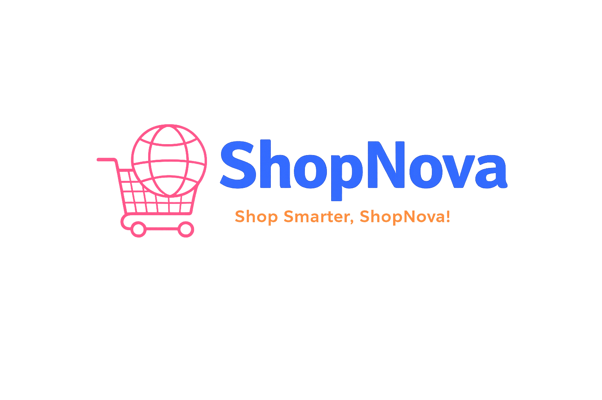

<div align="center">



# 🛒 ShopNova – E-Commerce Web Application

### Shop Smarter, Shop ShopNova!

</div>

<p align="center">
A modern full-stack e-commerce web application built using React, TypeScript, Node.js and PostgreSQL.
</p>

<p align="center">
⚠️ This project is built for educational and portfolio purposes.
</p>

---

# 📖 Introduction

**ShopNova** is a full-stack e-commerce application created for learning and portfolio purposes.

The project simulates a real online shopping platform where users can browse products, manage a cart, create accounts, and place simulated orders.

It demonstrates how modern frontend and backend technologies work together in a real-world web application.

---

# 🛠️ Tech Stack

## 🖥️ Frontend
- React
- TypeScript
- TailwindCSS
- Vite
- Axios
- React Router
- React Hook Form
- React Query

## ⚙️ Backend
- Node.js
- Express.js
- TypeScript
- Express Validator
- JWT Authentication

## 🗄️ Database
- PostgreSQL
- TypeORM

## 📦 Package Management
- npm

---

# ✨ Features

### 👤 Authentication System
- User registration
- User login
- JWT authentication
- Secure password handling

### 🛍️ Product System
- Browse products
- View product details
- Search functionality
- Category filtering

### 🛒 Cart System
- Add items to cart
- Remove items from cart
- Update product quantity

### ⭐ Reviews & Ratings
- Users can review products
- Rating system for products

### 📦 Orders
- Simulated checkout process
- Order history tracking
- Purchase simulation

### ⚙️ Account Management
Users can manage:
- Name
- Username
- Email
- Password
- Avatar
- Address

### 📱 Responsive Design
The UI works across:
- Desktop
- Tablet
- Mobile devices

---

# 📂 Project Structure

```text
ShopNova
│
├── client        # React Frontend
│
├── server        # Node.js + Express Backend
│
└── assets        # Images and media files


🚀 Getting Started
1️⃣ Clone the repository
git clone https://github.com/Abhi1442004/ShopNova.git


2️⃣ Install dependencies

Frontend:
cd client
npm install

Backend:
cd server
npm install


3️⃣ Run the project

Frontend:
npm run dev

Backend:
npm run start:dev


🎯 Purpose of This Project

This project was built to practice:

Full-stack development

REST API design

Authentication systems

Database integration

Modern React architecture


👨‍💻 Author

Abhi Tiparala

GitHub
https://github.com/Abhi1442004